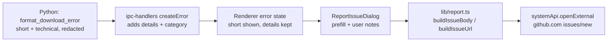

# One-Click Issue Reporting — Design

Date: 2026-07-15
Status: Approved

## Overview

When a download fails, users currently see a short friendly error message
(from the FFmpeg reliability work, commit `1bc4c5a`), and the full technical
detail goes to analytics. This feature adds a **"Report this issue"** button to
failed-download states that opens a prefilled dialog and, on submit, opens the
browser at `github.com/Cliply/Cliply/issues/new` with the title, labels, error
details, logs, and system info already filled in. The user reviews and clicks
"Submit new issue" on GitHub.

## Goals

- One-click path from a failed download to a well-formed GitHub issue.
- Reports carry everything a maintainer needs: short error, error category,
  redacted technical log tail, app version, OS/arch, yt-dlp version.
- Zero infrastructure and zero bundled secrets.

## Non-Goals (v1)

- No proxy service / GitHub API submission (v2 option if users abandon at the
  GitHub login step; only the submit action would change).
- No persistent log files — the report reuses the error payload that already
  travels with each failure.
- No screenshots, no reporting for non-download errors.

## Mechanism decision

**Prefilled GitHub issue URL** (`/issues/new?title=…&body=…&labels=…`).
Chosen over a proxy service (requires hosted infra, secret management, spam
handling) and in-app device-flow OAuth (clunky UX, most code). GitHub login is
the spam protection. Constraint: full URL must stay under ~8,000 characters —
the body builder trims the log tail to fit, and the complete report is copied
to the clipboard as a fallback.

## Architecture

### Data flow

### 1. Python (`python/server.py`)

- Add `yt_dlp_version` (from `yt_dlp.version.__version__`) to the root `/`
  status payload. One line; the Electron side reads it for diagnostics.

### 2. Electron main (`src/main/ipc-handlers.js`)

- Download error responses (combined + audio + pinterest + tiktok paths) gain:
  - `details`: the full technical string (already available — currently sent
    only to analytics). Already PII-redacted by `redact_user_paths()`.
  - `category`: result of `categorizeError()` (e.g. `FFMPEG_AV_BLOCKED`).
- New handler `DIAGNOSTICS_GET` (`diagnostics:get`) returning:
  `{ appVersion, electronVersion, platform, osRelease, arch, ffmpegAvailable,
  ytDlpVersion, serverReady }`. Server-dependent fields are read from the
  Python root endpoint when the server is up; otherwise null.
- Register the new channel in the validated-channels list.

### 3. Preload (`src/preload/preload.js`)

- Expose `electronAPI.system.getDiagnostics()` → `DIAGNOSTICS_GET`.

### 4. Renderer

- `lib/report.ts` — **pure functions, unit-tested**:
  - `buildIssueBody(report): string` — markdown body: description (user text),
    error section, environment table, collapsed `
` log block.
  - `buildIssueUrl(body, title, labels): { url, truncated }` — URL-encodes
    and trims the log block line-by-line until the URL fits the 8,000-char
    budget; `truncated` tells the dialog to mention the clipboard fallback.
- `components/report/ReportIssueDialog.tsx` — Radix dialog matching existing
  UI. Sections: error summary (read-only), environment (read-only, from
  `getDiagnostics`), collapsible log preview (transparency — the user sees
  exactly what is sent), optional "what were you doing" textarea, and an
  **off-by-default** "Include the video URL" checkbox.
  Submit: copy full body to clipboard → `openExternal(url)` → toast
  ("Full report copied to clipboard" when truncated).
- Error surfaces: the failure toasts in `useVideoDownload` / `useAudioDownload`
  (and the pinterest/tiktok equivalents) gain a "Report" action button; the
  failed-state UI cards get the same button. Failure state must retain
  `{ message, details, category, platform, videoUrl }` so the dialog can be
  opened after the toast disappears.
- Types: extend the `IPCResponse` error shape in `lib/api.ts` with optional
  `details` / `category`; add `systemApi.getDiagnostics()`.

### 5. Repo (GitHub side)

- `.github/ISSUE_TEMPLATE/bug_report.yml` mirroring the generated structure,
  so hand-written issues match.
- Labels used by generated URLs: `bug`, `auto-report` (create in repo).

## Privacy

- Technical detail is already scrubbed of home-directory usernames by
  `redact_user_paths()` (Python side) before it ever reaches Electron.
- The video URL is included **only** when the user ticks the checkbox
  (default off).
- Nothing is sent anywhere automatically — submission is the user clicking
  GitHub's own submit button in their browser.

## Error handling

- Server down / diagnostics unavailable → dialog still opens; environment
  fields show "unknown".
- `details` missing (e.g. pre-download validation errors) → dialog works with
  just the short message.
- `openExternal` failure → toast with "Report copied to clipboard — paste it
  at github.com/Cliply/Cliply/issues/new".

## Testing

- Unit tests for `buildIssueBody` / `buildIssueUrl`: normal case, long log
  truncation (URL stays under budget), missing details, URL consent on/off,
  encoding of special characters. These are the repo's first renderer unit
  tests; the runner (vitest in the renderer package vs. root Jest with a TS
  transform) is chosen in the implementation plan based on what needs the
  least new config.
- Manual: force a failure (unwritable download dir), click Report, verify the
  opened GitHub page contains the prefilled body.

## Sequencing

Built on top of commit `1bc4c5a` (FFmpeg reliability). Independent of the
stashed media-export feature.
